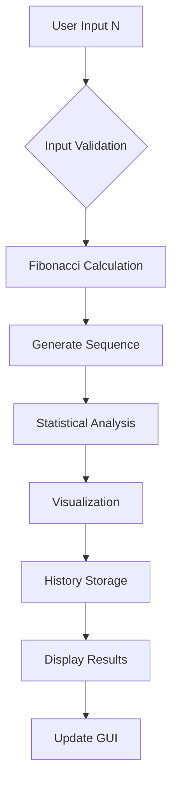

# 🔢 Generator Deret Fibonacci

<div align="center">


**Aplikasi canggih untuk menghasilkan, menganalisis, dan memvisualisasikan deret Fibonacci dengan antarmuka grafis modern**

[Fitur](#-fitur) • [Instalasi](#-instalasi) • [Penggunaan](#-penggunaan) • [Dokumentasi](#-dokumentasi)
</div>

## 📋 Daftar Isi

- [Gambaran Umum](#-gambaran-umum)
- [Fitur](#-fitur)
- [Instalasi](#-instalasi)
- [Penggunaan](#-penggunaan)
- [Dokumentasi](#-dokumentasi)
- [Konfigurasi](#-konfigurasi)
- [Contoh Penggunaan](#-contoh-penggunaan)
- [FAQ](#-faq)
- [Matematika Fibonacci](#-matematika-fibonacci)

## 🚀 Gambaran Umum

**Generator Deret Fibonacci** adalah aplikasi Python canggih yang menyediakan antarmuka grafis modern untuk menghasilkan, menganalisis, dan memvisualisasikan deret Fibonacci. Aplikasi ini tidak hanya menghasilkan deret angka, tetapi juga memberikan analisis statistik mendalam, visualisasi grafik, dan sistem penyimpanan riwayat yang komprehensif.

### ✨ Highlights

- 🎨 **GUI Modern** dengan tema profesional dan intuitif
- 📊 **Visualisasi Grafik** interaktif dengan Matplotlib
- 📈 **Analisis Statistik** lengkap dan real-time
- 💾 **Sistem Riwayat** otomatis dengan ekspor data
- 🧮 **Perhitungan Efisien** untuk deret besar
- 🔍 **Golden Ratio Analysis** analisis rasio emas
- 📁 **Modular Architecture** kode terstruktur dan mudah dikembangkan

## 🌟 Fitur

### 🔢 Core Fibonacci Features
- **Deret Fibonacci Lengkap** - Menghasilkan deret hingga suku ke-n
- **Multiple Start Options** - Dukungan untuk F(0)=0 atau F(1)=1
- **Optimized Calculation** - Algoritma efisien untuk deret besar
- **Error Handling** - Validasi input dan penanganan error

### 📊 Visualization & Analysis
- **Line Chart** - Grafik pertumbuhan deret Fibonacci
- **Ratio Analysis** - Visualisasi konvergensi ke Golden Ratio
- **Statistical Dashboard** - Panel statistik lengkap
- **Golden Ratio Comparison** - Perbandingan dengan φ (1.61803398875)

### 💾 Data Management
- **Auto-save History** - Penyimpanan otomatis setiap perhitungan
- **JSON Storage** - Format penyimpanan terstruktur
- **Export Capability** - Ekspor riwayat ke file teks
- **Session Management** - Kelola multiple calculation sessions
- **Quick Load** - Muat ulang perhitungan dari riwayat

### 🎨 GUI Features
- **Modern Interface** - Tema profesional dengan warna harmonis
- **Tabbed Interface** - Organisasi konten yang intuitif
- **Real-time Updates** - Update statistik dan grafik secara real-time
- **Responsive Design** - Adaptif berbagai ukuran layar
- **Keyboard Shortcuts** - Navigasi cepat dengan keyboard

### 📈 Advanced Analytics
- **Statistical Summary** - Rata-rata, total, min, max
- **Even/Odd Analysis** - Analisis distribusi genap/ganjil
- **Growth Pattern** - Pola pertumbuhan deret
- **Ratio Convergence** - Analisis konvergensi rasio
- **Performance Metrics** - Waktu eksekusi dan efisiensi

## 📥 Instalasi

### Prerequisites

- Python 3.7 atau lebih tinggi
- pip (Python package manager)

### Step-by-Step Installation

1. **Clone atau Download Repository**
   ```bash
   git clone https://github.com/username/fibonacci-generator.git
   cd fibonacci-generator
   ```

2. **Buat Virtual Environment (Recommended)**
   ```bash
   python -m venv fib_env
   source fib_env/bin/activate  # Linux/Mac
   fib_env\Scripts\activate    # Windows
   ```

3. **Install Dependencies**
   ```bash
   pip install -r requirements.txt
   ```

4. **Verifikasi Instalasi**
   ```bash
   python main.py
   ```

### Dependencies

```txt
matplotlib>=3.5.0
pillow>=9.0.0
```

### Quick Install (Windows)
```bash
# Download dan ekstrak project
python main.py
```

## 🎮 Penggunaan

### Menjalankan Aplikasi

```bash
python main.py
```

### Basic Usage

1. **Memasukkan Parameter**
   - Masukkan nilai N (jumlah suku Fibonacci) di field input
   - Klik "Hasilkan Deret" atau tekan `Enter`

2. **Melihat Hasil**
   - **Tab "Deret Fibonacci"**: Deret lengkap dengan format rapi
   - **Tab "Visualisasi Grafik"**: Grafik deret dan analisis rasio
   - **Tab "Analisis Statistik"**: Statistik lengkap dan analisis

3. **Mengelola Riwayat**
   - Double-click entri riwayat untuk memuat ulang
   - Gunakan tombol untuk segarkan, bersihkan, atau ekspor riwayat

### Keyboard Shortcuts

| Shortcut | Action |
|----------|--------|
| `Enter` | Generate deret |
| `Ctrl + C` | Clear semua |
| `Ctrl + R` | Refresh history |
| `Ctrl + E` | Export history |
| `Ctrl + Q` | Keluar aplikasi |

### Contoh Input

```
N = 10    # Menghasilkan 10 suku pertama
N = 20    # Menghasilkan 20 suku pertama  
N = 50    # Untuk analisis konvergensi rasio
```

## 📚 Dokumentasi

### Workflow Diagram



### Mathematical Foundation

Deret Fibonacci didefinisikan sebagai:
```
F(0) = 0
F(1) = 1
F(n) = F(n-1) + F(n-2) untuk n ≥ 2
```

Rasio Golden Ratio (φ) ≈ 1.61803398875

---

### File Descriptions

| File | Description |
|------|-------------|
| `main.py` | Entry point aplikasi, menjalankan GUI |
| `fibonacci_calculator.py` | Engine perhitungan dan analisis Fibonacci |
| `history_manager.py` | Manajemen penyimpanan dan load riwayat |
| `gui_interface.py` | Antarmuka pengguna dengan Tkinter dan Matplotlib |
| `requirements.txt` | Dependencies yang diperlukan |

## ⚙️ Konfigurasi

### Customization Settings

Edit kode di `gui_interface.py` untuk menyesuaikan:

```python
# Warna tema
COLOR_SCHEME = {
    'primary': '#2c3e50',
    'secondary': '#34495e', 
    'accent': '#3498db',
    'success': '#27ae60',
    'warning': '#f39c12',
    'danger': '#e74c3c'
}

# Pengaturan grafik
GRAPH_CONFIG = {
    'figure_size': (10, 4),
    'dpi': 100,
    'style': 'ggplot'
}
```

### Performance Settings

```python
# Untuk deret yang sangat besar
MAX_SEQUENCE_LENGTH = 10000
MEMORY_OPTIMIZATION = True
```

## 💡 Contoh Penggunaan

### Basic Sequence Generation
```
Input: N = 10
Output: 0, 1, 1, 2, 3, 5, 8, 13, 21, 34
```

### Statistical Analysis Example
```
Jumlah suku: 10
Total: 88
Rata-rata: 8.80
Suku terbesar: 34
Suku terkecil: 0
Jumlah genap: 4, Jumlah ganjil: 6
Rasio terakhir: 1.619048
Golden Ratio: 1.618034
Selisih: 0.001014
```

### Advanced Analysis
```
Input: N = 20
Analisis: Konvergensi rasio F(n)/F(n-1) → φ
Visualisasi: Grafik eksponensial karakteristik
```

## ❓ FAQ

### Q: Berapa nilai N maksimal yang didukung?
**A:** Aplikasi mendukung hingga N=10000, tetapi nilai di atas 1000 mungkin membutuhkan waktu lebih lama.

### Q: Bagaimana cara backup data riwayat?
**A:** Semua riwayat tersimpan otomatis di `fibonacci_history.json` dan bisa diekspor ke format teks.

### Q: Apakah bisa menghitung deret Fibonacci modifikasi?
**A:** Ya, struktur code modular memungkinkan modifikasi mudah untuk variasi deret Fibonacci.

### Q: Bagaimana akurasi perhitungan rasio golden ratio?
**A:** Akurasi hingga 15 digit desimal, cukup untuk sebagian besar analisis matematis.

### Q: Bisakah diintegrasikan dengan library AI/ML?
**A:** Tentu! Output deret bisa diintegrasikan dengan library seperti NumPy, SciPy, atau TensorFlow.

### Q: Apakah support export ke format lain selain teks?
**A:** Saat ini support teks, tapi mudah dikembangkan untuk CSV, JSON, atau Excel.

## 🔢 Matematika Fibonacci

### Deret Fibonacci
```
F₀ = 0, F₁ = 1, Fₙ = Fₙ₋₁ + Fₙ₋₂ untuk n ≥ 2
```

### Golden Ratio (φ)
```
φ = (1 + √5) / 2 ≈ 1.618033988749895
lim(n→∞) Fₙ/Fₙ₋₁ = φ
```

### Properties Penting
- **Binet's Formula**: Formula tertutup untuk Fₙ
- **Cassini's Identity**: Fₙ₋₁Fₙ₊₁ - Fₙ² = (-1)ⁿ
- **Sum Properties**: ∑Fₖ = Fₙ₊₂ - 1


---

<div align="center">

**⭐ Jangan lupa beri bintang jika project ini membantu! ⭐**

[Kembali ke Atas](#-generator-deret-fibonacci)

*"Mathematics is the poetry of the universe." - Fibonacci*

</div>